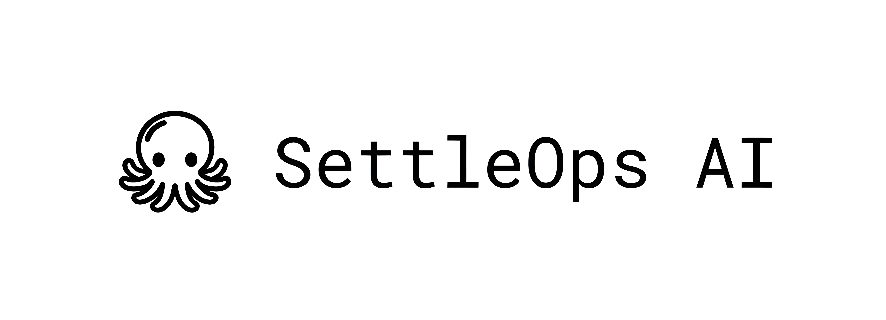

<div align="center">
  
  <br />
  <p><strong>The intelligence behind insurance claim decisions — multi-agent AI that turns a 2-4 day manual review into a 90-second AI-assisted decision.</strong></p>
  <p>
    
    
    
    
    
    
    
  </p>
</div>

---

## Hackathon Submissions

### Final Stage
-   **[Refined Quality Assurance Testing Document (PDF)](./Final-Quality%20Assurance%20Testing%20Documentation%20(spectrUM).pdf)**
-   **[Business Proposal](./Final-Business%20Proposal%20(spectrUM).pdf)**
-   **[Deployment Plan](./Final-Deployment%20Plan%20(spectrUM).pdf)**
-   **[Final Round Pitch Deck](./Final-Pitch%20Deck%20(spectrUM).pdf)**

### Preliminary Stage
-   **[Product Requirement Documentation (PRD)](./Product%20Requirement%20Documentation%20(Team%20spectrUM).pdf)**
-   **[System Analysis Documentation (SAD)](./System%20Analysis%20Documentation%20(Team%20spectrUM).pdf)**
-   **[Quality Assurance Testing Documentation (QATD)](./Quality%20Assurance%20Testing%20Documentation%20(Team%20spectrUM).pdf)**
-   **[Pitch Deck](./Pitch%20Deck.pdf)**
-   **[Pitching Video Google Drive](https://drive.google.com/file/d/1bGQ-UCeKLpXQD6t4sACn5RKw2GfPQTo8/view?usp=sharing)**

---

## Introduction
SettleOps AI is an agentic decision-support platform built for motor insurance claim officers. It ingests every artifact in a claim file — police reports, policy schedules, cover notes, adjuster reports, workshop quotations, and crash photos — and returns a structured, fully-cited claim decision in under 90 seconds.

The platform is not an autopilot. It is a **decision cockpit**: a fleet of specialized AI agents draft the reasoning, surface every supporting citation, and escalate to a human officer whenever confidence is low. The officer reviews, challenges, or approves — and remains the sole final decision-maker on every claim.

> *"Every claim is a puzzle. Solved manually, every time."*
> SettleOps AI solves the puzzle so officers can focus on judgment, not paperwork.

---

## Core Problem
Motor insurance claim review is a high-volume, high-context, low-leverage task. A single claim contains:

-   **Too many documents, no single source of truth**： police reports, adjuster reports, policy & cover notes, workshop quotations, and crash photos all need to be cross-referenced by hand.
-   **A manual decision-making bottleneck**： 2-4 days per claim, 15-25 claims per officer per day, with constant context switching between PDFs, photos, and policy clauses.
-   **Repetitive cognitive labor**： the same reasoning steps (verify coverage, allocate fault, validate quotes, screen for fraud) are re-done from scratch for every claim.
-   **Inconsistency and missed fraud**： fatigue and document overload cause inconsistent verdicts and let suspicious patterns slip through.

> **The pain point: manual review is a repetitive task. It is the problem.**

---

## Solution
SettleOps AI replaces the repetitive parts of claim review with a structured **PEVR (Plan, Execute, Verify, Replan)** multi-agent pipeline, while keeping the officer in the driver's seat.

1.  **Reads everything**： the Intake agent parses every uploaded document (PDF, image, structured form) and tags it on a shared Decision Blackboard.
2.  **Reasons sequentially *and* in parallel**： the orchestrator runs causally-dependent steps sequentially (Intake → Policy → Liability → Payout) while fanning out independent specialist clusters (Damage, Fraud, Reconstruction) in parallel — minimizing latency without breaking causal order. All clusters run on Gemini 2.5 Flash with a 1M-token context.
3.  **Self-audits**： a Senior Auditor agent cross-checks every verdict for inconsistency before the case is shown to a human.
4.  **Drafts the decision**： outputs a formal, citation-backed Decision PDF and a machine-readable Audit Trail JSON.
5.  **Escalates when uncertain**： low-confidence cases are flagged, never guessed.
6.  **Human-in-the-loop — one officer signs off**： a single accountable officer reviews the draft and takes legal responsibility by Approving, Declining, or **Challenging** a specific reasoning node to trigger a surgical rerun of just that agent.

> **Officers stop doing paperwork. They start making decisions — and remain accountable for them.**

### Why a Human Still Signs
Insurance decisions carry legal, regulatory, and reputational weight. SettleOps AI is intentionally designed as **near-full automation today, with a single accountable human in the loop**. The officer is the only party authorized to commit the insurer to a payout — the AI does the heavy lifting; the human owns the part that matters: *responsibility*.

### The Path to Full Automation
SettleOps AI is built to evolve along a deliberate autonomy curve — we start *close* to full automation and earn our way to *fully* automated as trust compounds. We do not flip a switch; we move the threshold.

| Stage | Behavior | Human Role |
| --- | --- | --- |
| **Stage 1 — Assisted (today)** | AI drafts every decision; human approves every claim | Sole decision-maker on every case |
| **Stage 2 — Supervised** | AI auto-approves high-confidence claims; humans review low-confidence + sampled audits | Reviewer on flagged + sampled cases |
| **Stage 3 — Autonomous** | AI handles end-to-end; humans govern policy, audits, and exceptions | Governance & exception handling |

### Self-Improvement Flywheel
Every officer interaction is a training signal. SettleOps AI compounds in quality over time:

1.  **Capture** — every approval, decline, and challenge is logged with the officer's reasoning and the affected agent node.
2.  **Diagnose** — the Refiner agent localizes which specialist agent (Policy, Liability, Damage, Fraud, Reconstruction) was overruled and why.
3.  **Tune** — claims managers update agent prompts (no code, no fine-tuning) based on aggregated challenge patterns.
4.  **Evaluate** — updated agents are replayed against historical cases to confirm the change improves accuracy without regression.
5.  **Promote** — validated improvements roll out, raising the auto-approval confidence threshold and shrinking the share of claims that need a human.

> Each human decision today buys back human time tomorrow. The system gets quieter as it gets smarter.

---

## Key Features
-   **13-Agent Reasoning Fleet**： Intake, Policy, Liability (Narrative + Point-of-Impact), Damage (Quote Audit + Pricing), Fraud, 3D Reconstruction, Payout, Adjuster, Auditor, and Refiner agents collaborate on a shared Decision Blackboard.
-   **PEVR Self-Correcting Pipeline**： Plan → Execute → Verify → Replan. The Auditor agent detects cross-document inconsistencies and triggers targeted reruns autonomously.
-   **3-Pane Decision Cockpit**： Live operator UI with Inputs (case assets), Workflow (real-time agent graph via React Flow), and Blackboard (structured verdicts + citations) — streamed over Server-Sent Events.
-   **Surgical Reruns (Human-in-the-Loop)**： Officers can challenge any single reasoning node with natural-language feedback; the Refiner agent re-runs only the affected cluster instead of the whole case.
-   **Visual Forensics**： Multimodal vision analysis on crash photos for Point of Impact (POI) classification, damage severity, and a 3D reconstruction view of the incident.
-   **Fraud Detection Cluster**： Dedicated agent screens for narrative inconsistencies, suspicious patterns, and quote inflation, returning a suspicion score with cited evidence.
-   **Full Audit Trail & Citations**： Every claim in every verdict is anchored to a source document excerpt; outputs include a signed Decision PDF and an Audit Trail JSON for compliance.
-   **Adjuster Loop**： When physical inspection is required, the workflow pauses, requests an adjuster report upload, and resumes from a LangGraph checkpoint.
-   **Customizable Agent Prompts**： Non-technical claims managers tune each specialist agent's behavior via persistent prompts stored locally — no code changes, no fine-tuning.
-   **AI Strategy Chat**： Conversational interface for officers to interrogate the underlying agentic logic in plain language.
-   **Digital Signature Flow**： Officers sign the final decision PDF in-app; the signed artifact is stored alongside the audit trail.

---

## Architecture
SettleOps AI is built as a stateful, agentic monolith managed by **LangGraph**. The architecture centers around a shared **Decision Blackboard** where agents collaboratively post their findings.


### The PEVR Cycle
1.  **Plan** — Intake Specialist categorizes documents and identifies which reasoning clusters are required.
2.  **Execute** — A hybrid sequential + parallel pipeline: causally-dependent agents run in sequence (Intake → Policy → Liability → Payout) while independent specialist clusters (Damage, Fraud, Reconstruction) fan out in parallel — all on Gemini 2.5 Flash.
3.  **Verify** — The Senior Auditor agent validates cross-document consistency.
4.  **Replan** — If conflicts are detected (or the officer challenges a node), the system triggers a surgical rerun of just the affected agent — and the Refiner feeds that signal into the self-improvement flywheel.

---

## Impact
| Metric | Calculation | Result |
| --- | --- | --- |
| Time reduction | Manual: 3 days (4,320 mins) per case -> AI: 10 mins per case | **99.7% time reduced** |
| Full-time employee capacity cut | Manual: 115 FTEs required for 10k cases -> AI: 1 oversight operator required | **From 115 employees to 1** |
| ROI (Rate of Investment) | Savings: 114 staff x 60K salary (6.84M) vs Cost: 50K system fee | **ROI = 13,580%** |

> From hours → minutes. From manual → intelligent.

---

## Tech Stack
### Frontend
-   **Framework**: Next.js 16.2 (App Router)
-   **Logic**: React 19
-   **Styling**: Tailwind CSS 4
-   **State**: Zustand 5
-   **Visualization**: React Flow / xyflow, Three.js (3D reconstruction view)

### Backend
-   **API**: FastAPI (Python 3.11+)
-   **Orchestration**: LangGraph & LangChain (with MemorySaver checkpointer for HITL resumption)
-   **Intelligence**: Google Gemini 2.5 Flash (1M Context)
-   **Extraction**: Microsoft MarkItDown & PyMuPDF
-   **PDF Generation**: ReportLab
-   **Streaming**: Server-Sent Events (SSE) for live agent telemetry
-   **Storage**: In-Memory Async-Locked CaseStore

---

## Getting Started

### Prerequisites
-   **Python 3.11+** (backend)
-   **Node.js 20+** (frontend — Next.js 16.2)
-   A **Google Gemini API key** ([aistudio.google.com](https://aistudio.google.com/app/apikey))
-   *(Optional)* ElevenLabs API key for voice features, Exa API key for web search

### 1. Clone the repository
```bash
git clone https://github.com/stanX19/SettleOps-AI.git
cd SettleOps-AI
```

### 2. Backend setup
```bash
cd backend
python -m venv venv
# Windows:
venv\Scripts\activate
# macOS / Linux:
source venv/bin/activate

pip install -r requirements.txt
```

Create `backend/.env` with at minimum:
```env
GEMINI_API_KEY=your_gemini_api_key_here
DEBUG=true
PORT=8000
CORS_ORIGINS=["http://localhost:3000"]

# Optional — only if you use these features
ELEVENLABS_API_KEY=
EXA_API_KEY=
```

Run the API:
```bash
python main.py
# Backend now serving at http://localhost:8000
# OpenAPI docs at http://localhost:8000/docs
```

### 3. Frontend setup
In a new terminal:
```bash
cd frontend
npm install
```

Create `frontend/.env.local`:
```env
NEXT_PUBLIC_API_URL=http://localhost:8000
```

Run the dev server:
```bash
npm run dev
# Frontend now serving at http://localhost:3000
```

### 4. Try it out
1.  Open [http://localhost:3000](http://localhost:3000).
2.  A development case `CLM-2026-00001` is auto-seeded on backend startup.
3.  Create a new claim, upload sample documents (police report, policy schedule, workshop quote, crash photos), and watch the live agent graph stream verdicts to the Blackboard.
4.  Approve, decline, or **challenge** any reasoning node to trigger a surgical rerun.

### Build for production
```bash
# Frontend
cd frontend && npm run build && npm start

# Backend
cd backend && uvicorn main:app --host 0.0.0.0 --port 8000
```

---

## Credits
**Built for UM Hackathon 2026 by Team spectrUM**.
