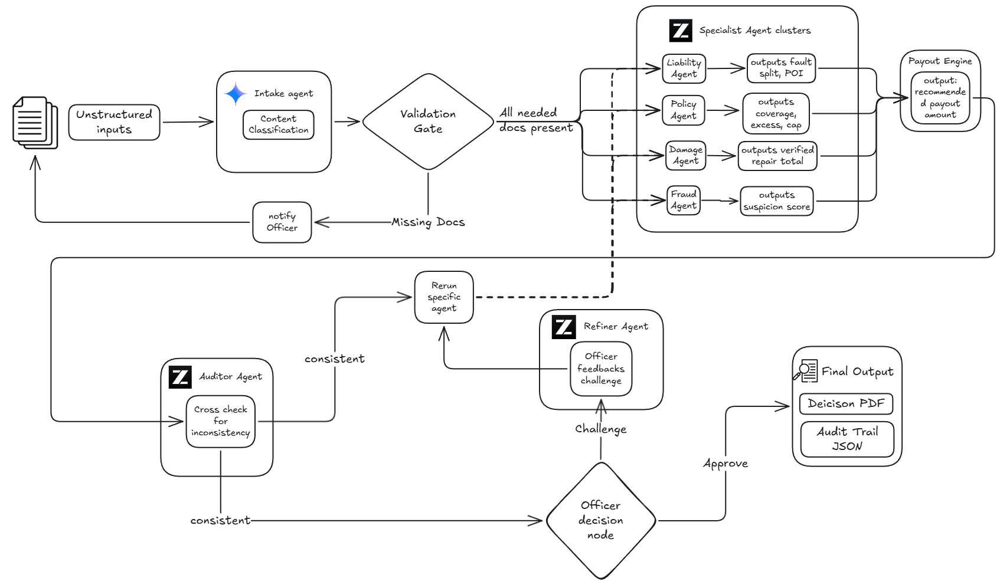

# SettleOps AI

**Multi-agent AI automation workflow for lightning-fast insurance claim decision support.**

---

## Hackathon Submissions
-   **[Product Requirement Documentation (PRD)](./Product%20Requirement%20Documentation%20(Team%20spectrUM).pdf)**
-   **[System Analysis Documentation (SAD)](./System%20Analysis%20Documentation%20(Team%20spectrUM).pdf)**
-   **[Quality Assurance Testing Documentation (QAT)](./Quality%20Assurance%20Testing%20Documentation%20(Team%20spectrUM).pdf)**
-   **[Pitch Deck](./Pitch%20Deck.pdf)**
-   **[Pitching Video](https://drive.google.com/file/d/1bGQ-UCeKLpXQD6t4sACn5RKw2GfPQTo8/view?usp=sharing)**

---

## Overview
SettleOps AI is an agentic platform designed to automate the complex, manual reasoning required for motor insurance claim reviews. By moving from manual document checking to a structured **PEVR (Plan, Execute, Verify, Replan)** pipeline, SettleOps AI reduces the time required to draft a claim decision from **60 minutes to under 90 seconds**.

The system utilizes a fleet of 13 specialized AI agents to cross-reference police reports, policy terms, and workshop quotes while performing forensic vision analysis on crash photos to ensure accuracy, consistency, and fraud detection.

---

## Key Features
-   **Multi-Agent Reasoning:** 13 specialized agents (Intake, Policy, Liability, Vision, Fraud, etc.) working in parallel.
-   **PEVR Pipeline:** A stateful "Plan, Execute, Verify, Replan" workflow that allows the system to autonomously correct its own reasoning.
-   **3-Pane Decision Cockpit:** A high-fidelity operator interface for real-time visualization of agent logic and evidence.
-   **Surgical Reruns:** Human-in-the-loop capability to challenge specific reasoning nodes and trigger targeted re-analysis.
-   **Visual Forensics:** Multimodal Vision AI to determine the Point of Impact (POI) and damage severity from photos.
-   **AI Strategy Chat:** A conversational interface for claims officers to interact with the underlying agentic logic.

---

## Architecture
SettleOps AI is built as a stateful, agentic monolith managed by **LangGraph**. The architecture centers around a shared **Decision Blackboard** where agents collaboratively post their findings.

### The PEVR Cycle
1.  **Plan:** Intake Specialist categorizes documents and identifies reasoning requirements.
2.  **Execute:** Parallel clusters (Policy, Liability, Fraud) analyze evidence using Gemini 2.5 Flash.
3.  **Verify:** The Senior Auditor agent validates cross-document consistency.
4.  **Replan:** If conflicts are detected, the system triggers a surgical rerun of the affected agent.

---

## Tech Stack
### Frontend
-   **Framework:** Next.js 16.2 (App Router)
-   **Logic:** React 19
-   **Styling:** Tailwind CSS 4
-   **State:** Zustand 5
-   **Visualization:** React Flow / xyflow

### Backend
-   **API:** FastAPI (Python 3.11+)
-   **Orchestration:** LangGraph & LangChain
-   **Intelligence:** Google Gemini 2.5 Flash (1M Context)
-   **Extraction:** Microsoft MarkItDown & PyMuPDF
-   **PDF Generation:** ReportLab
-   **Storage:** In-Memory Async-Locked CaseStore

---

## Credits
**Built for UM Hackathon 2026 by Team spectrUM**.
