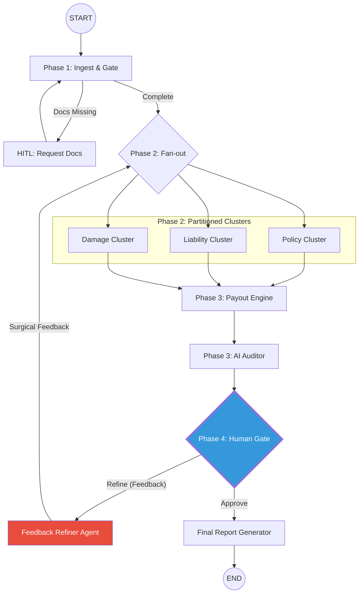

# Implementation Plan: Auditor-Orchestrated Insurance Claims Engine

This document provides a detailed step-by-step implementation guide for the Agentic Auto Insurance Claims Workflow.

## 1. System Architecture Overview
The system follows a **4-Phase Interactive Map-Reduce Architecture** designed for high-precision human-in-the-loop (HITL) refinement.

- Phase 1 (Ingestion): Extraction, categorization, and deterministic validation gate.
- Phase 2 (Analysis): Parallel Partitioned Clusters (Policy, Liability, Damage, Fraud) with built-in Reflection capabilities.
- Phase 3 (Payout/Auditor): Consolidation through a Payout Engine followed by an AI Auditor review.
- Phase 4 (Refinement): A continuous loop involving a Human Decision Gate (via Chat).

### Core Philosophy: "The Evergreen Graph"
The graph does not automatically end. It pauses at a **Decision Gate** and waits for a human signature. If challenged, it performs a "Surgical Loop" back to the relevant cluster.

### Graph Topology


---

## 2. Environment & Dependencies
**Requirements:**
- Python 3.12 (See backend/requirements.txt for source of truth)
- langchain-core
- langgraph

---

## 3. Step 1: Define the Global State (The Blackboard)
File: `project/backend/srcs/schemas/state.py`

Use `TypedDict` and `Annotated` with specific reducers. **Crucial:** We partition results to prevent parallel agents from overwriting each other's data.

```python
from typing import Annotated, TypedDict, Any, Optional, List
import operator

class ChallengeState(TypedDict):
    target_cluster: str # "policy", "liability", "damage"
    feedback: str      # The specific human/auditor instruction
    iteration: int     # Counter to prevent infinite loops

class ClaimWorkflowState(TypedDict):
    # Base Data
    case_id: str
    documents: List[dict]
    
    # The Partitioned Blackboard
    # Using separate keys prevents 'shallow merge' data loss in parallel paths
    policy_results: Annotated[dict[str, Any], lambda x, y: {**x, **y}]
    liability_results: Annotated[dict[str, Any], lambda x, y: {**x, **y}]
    damage_results: Annotated[dict[str, Any], lambda x, y: {**x, **y}]
    
    # THE AUDIT TRAIL: Every agent MUST append their reasoning here
    trace_log: Annotated[List[str], operator.add]
    
    # Routing & Loop Controls
    active_challenge: Optional[ChallengeState]
    status: str # "ingesting" | "analyzing" | "awaiting_approval" | "completed"
    
    # Metadata
    current_agent: Optional[str]
```

---

## 4. Step 2: The Reusable Cluster Factory (Map-Reduce with Reflection)
File: `project/backend/srcs/utils/cluster_factory.py`

This factory creates a parallel subgraph. **Senior Note:** Each task node is wrapped in a "Reflection" logic that reads the `active_challenge` if it exists.

```python
from langgraph.graph import StateGraph, START, END
from langgraph.types import Send

def create_cluster_subgraph(cluster_id: str, sub_tasks: List[Callable]):
    """
    cluster_id: e.g. "liability"
    sub_tasks: List of functions to run in parallel
    """
    builder = StateGraph(dict)

    def fan_out(state):
        # Maps global state to parallel sub-tasks
        return [Send(f"task_{i}", state) for i in range(len(sub_tasks))]

    for i, task_fn in enumerate(sub_tasks):
        def reflection_wrapper(state, task=task_fn):
            # 1. Check if there is feedback for this specific cluster
            feedback = None
            if state.get("active_challenge", {}).get("target_cluster") == cluster_id:
                feedback = state["active_challenge"]["feedback"]
            
            # 2. Execute task (If feedback exists, inject it as 'correction' prompt)
            result = task(state, feedback=feedback)
            
            # 3. Append to trace_log
            return {
                f"{cluster_id}_results": result["data"],
                "trace_log": [f"[{cluster_id}] {result['reasoning']}"]
            }
            
        builder.add_node(f"task_{i}", reflection_wrapper)

    def aggregate(state):
        # Final consistency check for the cluster before returning to main graph
        return {"status": f"{cluster_id}_complete"}

    builder.add_node("aggregator", aggregate)
    # START -> tasks -> aggregator -> END
    return builder.compile()
```

---

## 5. Step 3: Phase 1 - Intake & Validation Gate
File: `project/backend/srcs/agents/intake.py`

- **Node `ingest_tagging`**: Use Vision/LLM to categorize files into the 8 required slots.
- **Node `validation_gate`**: Deterministic check. If `count(required_docs) < 8`, set status to `awaiting_docs` and trigger `interrupt_before`.

---

## 6. Step 4: Phase 2 - Analysis Clusters
Implement 4 clusters using the factory.

### Liability Cluster Sub-tasks:
1. **Narrative Analysis**: Extract story from Police Report.
2. **POI Analysis**: Extract Point of Impact from photos.
3. **Consistency Check**: Do photos match the narrative?

### Damage Cluster Sub-tasks:
1. **Quote Auditor**: Line-by-line verification of parts.
2. **Labor Audit**: Check labor hours against industry standards.

---

## 7. Step 5: Phase 3 - Payout (Deterministic Python)
File: `project/backend/srcs/agents/payout.py`

**CRITICAL:** This must NOT be an LLM node.
```python
def payout_node(state: ClaimWorkflowState):
    case_facts = state.get("case_facts", {})
    policy = state.get("policy_results", {})
    liability = state.get("liability_results", {})
    damage = state.get("damage_results", {})
    
    # Calculation: (Verified_Total * Liability_%) - Excess - Depreciation
    # Apply policy caps and limits from policy_results
    return {"payout_results": result}
```

---

## 8. Step 6: Phase 4 - The Auditor & Decision Gate (HITL)
File: `project/backend/srcs/agents/auditor.py`

This phase handles both autonomous and human validation.

### The AI Auditor
This node performs a cross-consistency check (e.g., *"Does the Workshop Quote match the Point of Impact photos?"*).

### The Decision Gate (Surgical Loop)
This node acts as the **Human Gateway**. We use `interrupt_before=["decision_gate"]`.

```python
def decision_router(state: ClaimWorkflowState):
    # 1. If human provided a challenge via Chat Agent
    if state.get("active_challenge"):
        return state["active_challenge"]["target_cluster"]
    
    # 2. If Auditor found an autonomous issue
    if state["status"] == "inconsistent":
        return "refiner" # Send to agent that clarifies the problem
        
    # 3. Otherwise, we are done
    return "report_generator"

# Main Graph definition:
builder.add_conditional_edges("decision_gate", decision_router, {
    "policy": "policy_cluster",
    "liability": "liability_cluster",
    "damage": "damage_cluster",
    "refiner": "feedback_refiner",
    "report_generator": "report_node"
})
```

---

## 9. Step 7: Chat Agent Integration (The Feedback Refiner)
File: `project/backend/srcs/agents/refiner.py`

The Chat Agent is the UI. When the user says *"The damage is actually on the rear,"* the **Feedback Refiner** node translates this into a structured `ChallengeState`.

```python
def refiner_node(state: ClaimWorkflowState):
    user_input = state.get("latest_user_message")
    # LLM translates: "It's on the rear" -> target: "damage", feedback: "Update POI to rear"
    challenge = llm_translate_user_intent(user_input)
    
    return {
        "active_challenge": challenge,
        "trace_log": [f"[Human] Challenge received: {user_input}"]
    }
```
---

## 10. Implementation Sequence
1. **Setup Partitioned State**: Define the `TypedDict` with separate keys and the `trace_log` list.
2. **Implement Payout Engine**: Write the deterministic Python logic for Phase 3.
3. **Build Cluster Factory**: Implement the `create_cluster_subgraph` with `Send` and `reflection_wrapper`.
4. **Implement Phase 1 Gate**: Verify the "HITL Doc Request" loop using an interrupt.
5. **Implement Phase 2 Clusters**: Write prompts for sub-agents, ensuring they append to the `trace_log`.
6. **Implement Phase 4 Refinement**:
   - Build the `decision_gate` node.
   - Build the `feedback_refiner` node.
   - Configure the graph with `interrupt_before=["decision_gate"]`.
7. **SSE Integration**: Emit status updates and `trace_log` entries to the frontend in real-time.
